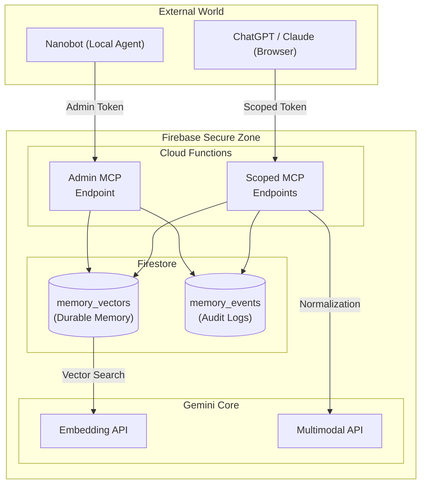
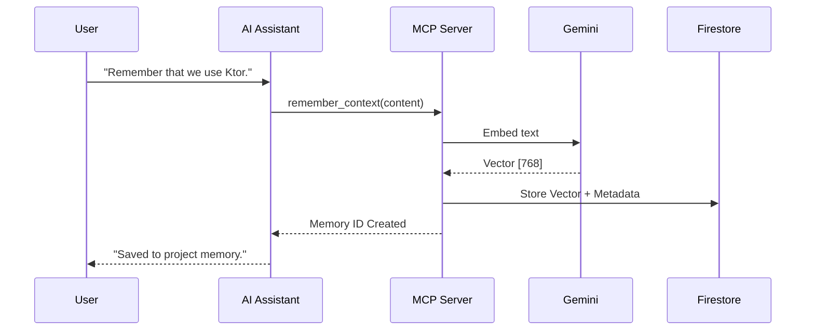
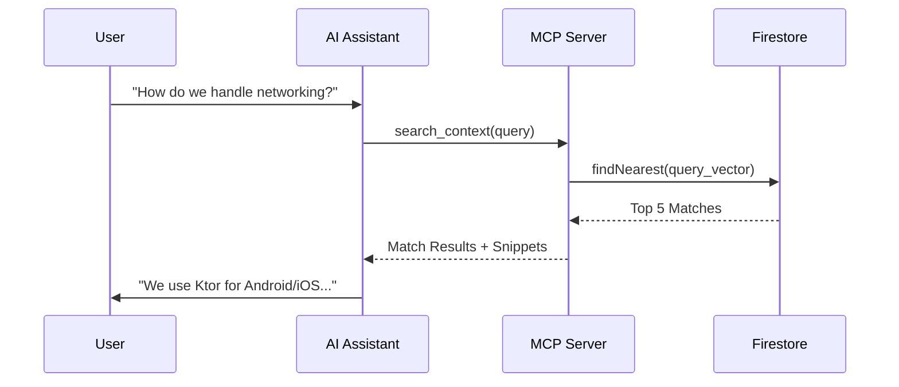

# Visual Design & System Architecture

Firebase Open Brain is a serverless MCP (Model Context Protocol) memory service. This document visualizes the system boundaries, personas, and primary use cases to provide a clear mental model of the ecosystem.

## 👥 Personas

| Persona | Role | Primary Toolset |
| :--- | :--- | :--- |
| **The Developer** | Builds and extends the project. | `firebase deploy`, `npm test`, CLI tools. |
| **Nanobot** | Local AI Agent inheriting this memory. | `search_context`, `remember_context`. |
| **The AI Assistant** | Browser-hosted assistant (ChatGPT/Claude). | `search_context`, `remember_context`, `fetch_context`. |
| **The Operator** | Manages the memory corpus. | `deprecate_context`, `get_consolidation_queue`. |

## 🏗️ System Boundaries

The system is partitioned into trust zones to ensure security and scalability.

> [!NOTE]
> **Normalization Path**: Since vector search is text-based, the system "normalizes" image memories into descriptive text using Gemini. This allows semantic search to find visual content (like screenshots) using natural language queries.

## 🔄 Primary Use Cases

### 1. Persistent Memory Growth
The AI Assistant saves new project decisions or requirements on behalf of the user.

### 2. Contextual Retrieval (The "Open Brain")
The Assistant searches the project's memory to answer a user's question.

## 🎨 Conceptual Visualization: Brain & Body

The relationship between the **Open Brain** and **Nanobot** is one of remote intelligence and local manifestation. The "Brain" resides in the cloud (Firebase/Gemini), providing durable memory and reasoning, while Nanobot acts as its "Body" on the local machine, executing tasks and interacting with the local environment.

