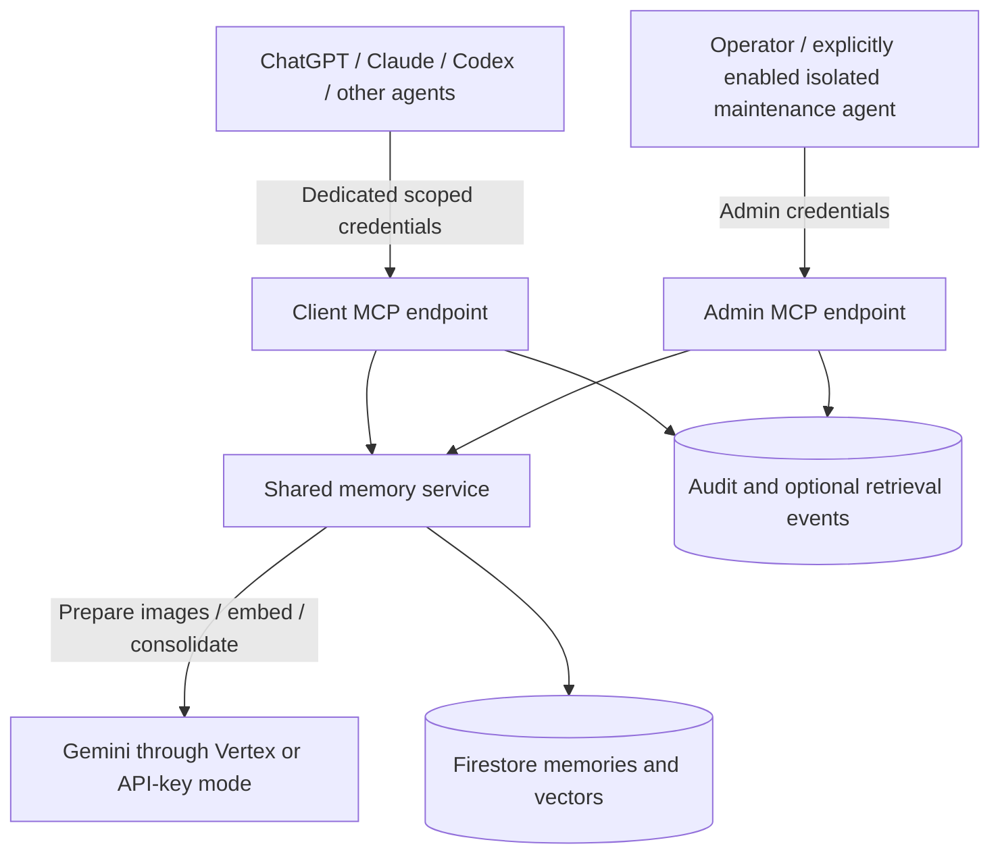

# MetaCortex architecture

## Current implementation

MetaCortex is an already-released, serverless user-memory service: Express and the MCP SDK run in Firebase Cloud Functions 2nd Gen; Firestore stores canonical memories and vectors. The [roadmap](../metacortexplan.md) is authoritative for future work. The [baseline record](operations/2026-10-01-adoption-baseline.md) distinguishes local integration from deployment evidence.

```mermaid
flowchart TD
    A[ChatGPT / Claude / Codex / other agents] -->|Dedicated scoped credentials| B[Client MCP endpoint]
    C[Operator / explicitly enabled isolated maintenance agent] -->|Admin credentials| D[Admin MCP endpoint]
    B --> E[Shared memory service]
    D --> E
    E -->|Prepare images / embed / consolidate| F[Gemini through Vertex or API-key mode]
    E --> G[(Firestore memories and vectors)]
    B --> H[(Audit and optional retrieval events)]
    D --> H
```

Agents share one corpus. Client profiles restrict tools, origins, and readable lifecycle states; they do not create tenant or topic isolation. Ordinary agents use save, search, and fetch. Listing is an explicit additional permission. Maintenance tools remain separate from ordinary conversation traffic.

HTTP requests pass CORS and credential checks before a stateless Streamable HTTP MCP request. The public `/healthz` endpoint reports health/topology. SSE is not supported. The current implementation also accepts legacy `auth_token` query credentials; OAuth, revocable dynamic grants, and their migration are planned, not implemented.

## Data flows

- **Save:** text and optional image → normalized canonical/retrieval text → embedding → Firestore document, metadata, and duplicate-write fingerprint.
- **Search:** query embedding → Firestore state/topic filters and nearest-neighbor search → temporal/provenance post-filtering → compact summaries and IDs. When a temporal or provenance filter is set, the search asks for up to five times the limit so filtering has candidates to keep, and returns at most the limit. A very selective filter can still return fewer results than the limit.
- **Fetch:** ID → document → client state-visibility check → public content and metadata. Internal `retrieval_text` is omitted.
- **List:** cursor-based enumeration with metadata/creation filters → summaries, IDs, and next cursor. It is not part of the default ordinary-agent profile.
- **Deprecate:** update lifecycle/supersession metadata; preserve the record for history. The current API requires a replacement ID.
- **Consolidate:** read sources → Gemini merge → create an active record → deprecate sources. This sequence is not presently atomic; retries/partial failures are a CORE milestone.

Images are normalized into text. Raw image assets are not stored or backed up; `artifact_refs` link to separately managed assets.

## Storage and model boundaries

Firestore client rules deny direct access to known server collections. Admin SDK access is controlled by IAM. Memory, fingerprints, audit events, retrieval telemetry, and evaluation data are separate collections. Collection/topic names are not authorization boundaries.

Embedding dimensions must match indexes. Never mix embedding spaces in one collection. Configuration and runtime clients are cached per cold start. Deployed runtime selection currently prefers Vertex when a Firebase project ID is available; API-key mode remains supported and the existing config still requires its key.

## Ownership and maintenance policy

The current correction prompt is a workflow convention, not proof of human authorization. Provenance and `initiator` fields are caller-provided. Ordinary agents must not receive maintenance authority. Optional isolated maintenance may consolidate or deprecate only under explicit owner authorization and conservative batch/review rules. Server-enforced owner identity, bounded maintenance, and correction authorization are future work.

No permanent deletion feature is planned. Physical database removal is manual administration. Existing operator restore/prune commands are recovery operations, not agent memory tools.

## Planned additions

Owner Google login/OAuth, browser-led Cloud Shell setup, an owner web dashboard, and a ChatGPT extension are in the [unified roadmap](../metacortexplan.md). They do not describe the current release. Local Docker hosting, multi-user tenancy, external document ingestion, and automatic conversation harvesting are out of scope.
